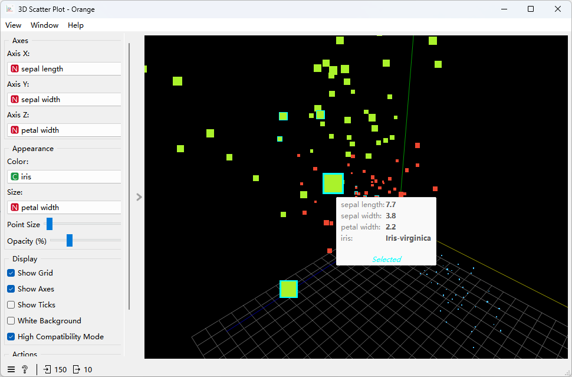

### Orange3 3D Scatter Plot Add-on / Orange3 3D 散点图插件

📸 Screenshots (截图)

$$English$$

A powerful, interactive 3D Scatter Plot widget for Orange Data Mining.
This widget fills the gap for 3D visualization in Orange, allowing users to visualize complex datasets with interactive rotation, zooming, and data selection capabilities. Built with pyqtgraph and OpenGL.

$$中文$$

这是一个为 Orange Data Mining 开发的高级 3D 散点图 插件。
它弥补了 Orange 原生组件在 3D 可视化方面的空白，支持交互式旋转、缩放、以及数据点选择功能。基于 pyqtgraph 和 OpenGL 开发。

### ✨ Key Features (核心功能)

Interactive 3D View (交互式 3D 视图)

Rotate, pan, and zoom freely to explore your data from any angle.

支持自由旋转、平移和缩放，全方位探索数据。

Data Selection (数据选择)

Click: Select a single point. (左键点击：选中单个点)

Ctrl + Click: Select multiple points. (Ctrl + 点击：多选/反选)

Visual Feedback: Selected points are highlighted with a "glow" effect. (视觉反馈：选中点会显示“光晕”高亮效果)

Output: Automatically sends selected data to downstream widgets. (输出：自动将选中数据发送给下游组件)

Dynamic Mapping (动态映射)

Map data variables to X/Y/Z axes, Color, and Point Size.

支持将变量映射到 X/Y/Z 轴、颜色（分类或连续变量）以及点的大小。

High Compatibility Mode (高兼容模式)

Includes a specialized mode for better performance on older graphics hardware.

内置“高兼容模式”，在旧显卡或驱动上也能流畅运行。

Customization (个性化设置)

Toggle Grid/Axes/Ticks, switch between Dark/White themes.

开关网格/坐标轴/刻度，支持黑/白两种背景主题切换。

### 🛠 Prerequisites (依赖环境)

To use this widget, you need (运行本插件需要):

Orange3

pyqtgraph

PyOpenGL

Install via pip (使用 pip 安装):

Please launch Orange Command Prompt from your Orange installation directory (or start menu), then run:

请在 Orange 安装路径下（或开始菜单中）启动 Orange Command Prompt，然后运行：

pip install orange3 pyqtgraph PyOpenGL

### 🚀 Installation (安装方法)

#### Method 1: Direct File Drop (Easy) / 方法一：直接拖入（推荐）

Locate your Orange installation's widget folder. Usually at:
.../site-packages/Orange/widgets/visualize/
找到 Orange 安装目录下的组件文件夹，通常位于 site-packages/Orange/widgets/visualize/。
比如我的文件路径为：D:\Program Files\Orange\Lib\site-packages\Orange\widgets\visualize

Copy owscatterplot3d.py into this folder.
将 owscatterplot3d.py 文件复制到该文件夹中。

Copy ScatterPlot3D.svg into the icons subdirectory.
将 ScatterPlot3D.svg 拖入 site-packages/Orange/widgets/visualize/icons 文件夹中。

Restart Orange Canvas.
重启 Orange 软件。

Find 3D Scatter Plot in the Visualize category.
在 Visualize (可视化) 分类中即可找到 3D Scatter Plot 组件。

#### Method 2: Development Load / 方法二：开发模式加载

Clone this repository. (克隆本仓库)

Open Orange Canvas. (打开 Orange)

Right-click on the widget toolbox -> Add Widget... and select the file path. (右键点击组件工具栏 -> Add Widget... -> 选择脚本路径)

### 🎮 Controls (操作说明)

Action (操作)

Mouse/Keyboard (鼠标/键盘)

Rotate (旋转视角)

Left Click + Drag Background (左键拖拽背景)

Pan (平移视角)

Middle Click + Drag / Shift + Drag (中键拖拽 / Shift+左键拖拽)

Zoom (缩放)

Mouse Wheel (鼠标滚轮)

Select Point (选中点)

Left Click on a point (左键点击数据点)

Multi-Select (多选)

Ctrl + Left Click (按住 Ctrl 点击)

Clear Selection (取消选择)

Click on Empty Space (点击空白处)

Reset View (重置视角)

Click "Reset Camera View" button (点击界面上的重置按钮)

### 🤝 Contributing (贡献)

Contributions are welcome! Please feel free to submit a Pull Request.
欢迎提交 Pull Request 改进代码！

### 📄 License (开源协议)

This project is licensed under the MIT License.
本项目采用 MIT 开源协议。